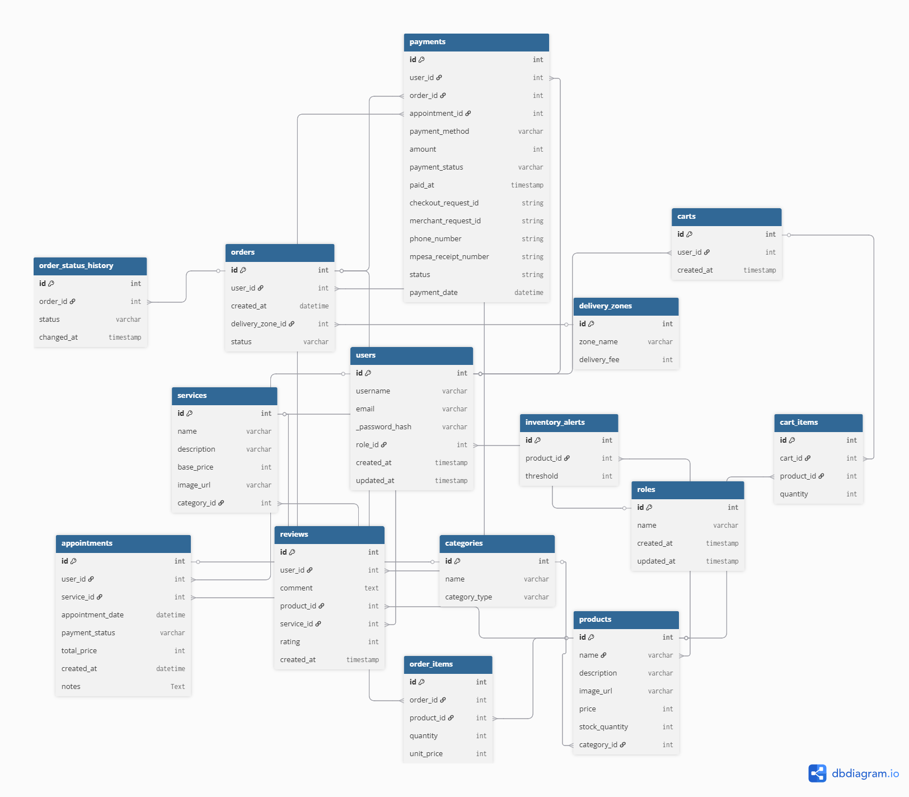

# Vetty

##### A full-stack web application for booking services and ordering pet products, featuring a React frontend and a RESTful Flask backend!

## Description
Vetty is Flask-SQLAlchemy + PostgreSQL + React-Redux software aimed at resolving the complexity of ordering pet products and booking services while maintainig  data consistency and persisting the changes to the Database. It implements flask-sqlalchemy, relational databases, API best practices using flask-restful and OOP to model the database and ensure accuracy while accessing the data.

The ideological business requirements are:

1. A `User `has many  `Roles`s but generally restricted to some via authorization.
2. A `User` can have  many `Appointment`s through `Bookings`.
3. An `User` can have many `review`.
4. A `Product` can have many `reviews`.
5. A `User` can have many `CartItem`s.
6. A `User` can only have *one* `Cart`.
7. A `User` can have many `Appointment`s. 
Those are just but the tip, to get the full data flow the ERD is provided below
_______
THE DEPLOYED LINK 👉[The site is live!](https://vetty-siuq.onrender.com)
_______

The ERD model of the relationships;

____

The models incorporate serialize_rules and association_proxies to limit recursion depth and simplify cross-model data access.
____
## Tech Stack
- Python
- SQL
- Markdown
- React
- PostgreSQL
- Render
- Flask
- Redux

## File Structure

Take a look at the src directory structure:

```console
src
│   ├── App.css
│   ├── App.jsx
│   ├── api
│   │   └── axios.js
│   ├── assets
│   │   └── react.svg
│   ├── components
│   │   ├── CartItem.jsx
│   │   ├── CategoryCard.jsx
│   │   ├── CategoryFilter.jsx
│   │   ├── Footer.jsx
│   │   ├── ItemCard.jsx
│   │   ├── ModalRoot.jsx
│   │   ├── MpesaModal.jsx
│   │   ├── NavLink.jsx
│   │   ├── Navbar.jsx
│   │   ├── Notification.jsx
│   │   ├── ProtectedRoute.jsx
│   │   ├── ReviewSection.jsx
│   │   ├── ReviewStars.jsx
│   │   ├── Routes.jsx
│   │   └── Spinner.jsx
│   ├── features
│   │   ├── adminSlice.js
│   │   ├── authSlice.js
│   │   ├── cartSlice.js
│   │   ├── productSlice.js
│   │   ├── reviewSlice.js
│   │   ├── serviceSlice.js
│   │   └── uiSlice.js
│   ├── index.css
│   ├── main.jsx
│   ├── pages
│   │   ├── Cart.jsx
│   │   ├── ErrorPage.jsx
│   │   ├── Home.jsx
│   │   ├── Layout.jsx
│   │   ├── Login.jsx
│   │   ├── MpesaForm.jsx
│   │   ├── ProductDetail.jsx
│   │   ├── Products.jsx
│   │   ├── Profile.jsx
│   │   ├── SellerSignup.jsx
│   │   ├── ServiceDetail.jsx
│   │   ├── Services.jsx
│   │   ├── Signup.jsx
│   │   ├── admin
│   │   │   ├── AdminDashboard.jsx
│   │   │   ├── AdminForm.jsx
│   │   │   ├── AdminList.jsx
│   │   │   ├── AdminOrders.jsx
│   │   │   ├── AdminProduct.jsx
│   │   │   ├── AdminUsers.jsx
│   │   │   ├── ApprovalStats.jsx
│   │   │   ├── CategoryAdmin.jsx
│   │   │   ├── DeliveryZoneAdmin.jsx
│   │   │   ├── InventoryAlertAdmin.jsx
│   │   │   └── ServiceAdmin.jsx
│   │   └── userDashboard.jsx
│   ├── setupTests.js
│   └── store.js
├── tailwind.config.cjs
├── tests.test.jsx
└── vite.config.js
    
```
And the backeng logic:

```console
.
├── Pipfile
├── Pipfile.lock
├── app.py
├── config.py
├── cookies.txt
├── image_utils.py
├── instance
│   └── app.db
├── migrations
│   ├── README
│   ├── alembic.ini
│   ├── env.py
│   ├── script.py.mako
│   └── versions
│       └── 5bef456cdb77_initial_postgres_migration.py
├── models.py
├── seed.py
└── tests
    ├── conftest.py
    └── test_endpoints.py

```


## Generating Your Environment

You might have noticed in the file structure- there's  a Pipfile!

Install  the dependencies  you'll need to navigate the file by 
adding them to the `Pipfile`. Run the commands:

```console
pipenv install
pipenv shell
```


## Environment Configurations Setup
To start working with the data  you need to:
1. Navigate to */server* dir:
```
cd server

```
2. Configure the flask environment commands:
```
    export FLASK_APP=app.py
    export FLASK_RUN_PORT=5555

```
This will allow you to start the server using :
```
flask run

```    
The commands below have been run for you:
```
flask db init
flask db migrate -m "Initial migration"
flask db upgrade head
python seed.py

```
To run the app and benefit from the debugger, use:
```shell
python app.py

```
Running it requires that you are in the */server* dir;
```bash
    cd server

```
To set up the frontend dependencies, from the root directory, run:

```console
$ npm install --prefix client
```

## Functionality
### Backend
# models.py
Our models import from `db.Model` and `SerializerMixin`.
The have similar constructors such as:
1. *__repr__*: In it is the modified output of a class instance to improve clarity.
2. *__tablename__*: Specifies the table in the database that the objects will be mapped to.
3. *serialize_rules*: It states the fields to be excluded to prevent recursion depth.
4. *association_proxy*: It simplifies access to the cross-model fields and data. 
5. @validates : a decorator that ensures that the constraints set are valid.

The models are:
-  Role
-  Appointment
-  Order
- OrderItem
- Cart
- User

Again, just a tip


# app.py
The views are Resources from `flask-restful` which ensures they are RESTful registration to routes.
The basic functionalities that can be ensued are:
1. (GET)*products()*: GET request to */products*.
2. (GET)*productsByID(id)*: Takes id as an argument and implements GET to the */products/:id*.
3. (GET)*users()*: GET request to */users*.
4. (GET, PATCH)*UserByID(id)*: Takes id as an argument and implements GET and PATCH to the */powers/:id*.
5. (GET, POST)*Review(id)*: POST to *houses*. 
Those are just but a few of them but you get the point.

# seed.py
It contains the data seeded to the `app.db`

# app.db
It holds our SQL database. In our case, we use PostgreSQL and therfore the db is stored in the server not in the files.
# config.py
It holds our configurations involving our app, DATABASE_URI and many other.

### Frontend
The frontend is heavily packed with files but the basic functionality is as follows:

1. `src/` : holds all the components and styling files.
2. `components/` : holds all the reusable components.
3. `pages` : Contains the main Components that take in the reusable components for render.
4. `styles`: Holds the css files.
5. `features`: Contain the slices.


# Authors
- *Collins Kibet*
- *Dorcas Chepkoech*
- *Brian Kipchumba*
- *Suleiman Said*

## [License](LICENSE)

MIT License
Copyright (c) 2026 Collins Kibet


# Contact info
* Email : kollcibe05@gmail.com
* Email : dorcaschepkoech717@gmail.com
* Email : real1sule@gmail.com
* Email : kipchumbabrian47@gmail.com

`(**Thank you**)`